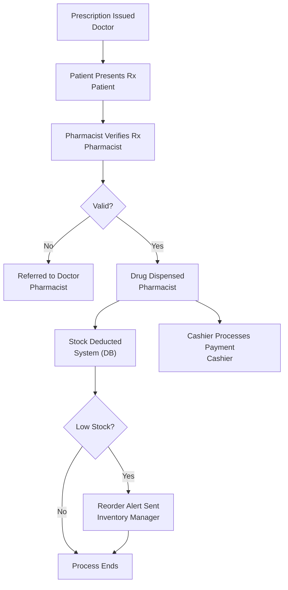

# Pharmacy Inventory & Prescription Tracking System

## Course Information

| Item | Details |
|------|---------|
| **Course** | DPR400210 – Database Programming with Oracle Database |
| **Type** | Individual Capstone Final Examination |
| **Institution** | University of Lay Adventists of Kigali (UNILAK), Faculty of Computing and Information Sciences |
| **Academic Year** | 2025–2026 |
| **Student** | Shedrick Duanah (ID: 30866) |
| **Naming Convention** | `30866_Shedrick_Pharmacy_DB` |

---

## Project Description

An Oracle database solution for a single-branch pharmacy that manages drug stock, expiry tracking, prescriptions, dispensing, and supplier reordering — with full audit logging and security controls. The system models the end-to-end prescription chain: doctor → patient → pharmacist verification → dispensing → stock deduction → reorder trigger, with cashier payment processed alongside dispensing.

**Scope:** Single branch, realistic scale (30–50+ drugs, dozens of patients).

---

## Repository Structure

| Folder | Phase | Contents |
|--------|-------|----------|
| `01_problem_statement/` | I | Problem statement — context of use, objectives, target users, expected benefits (3-slide PowerPoint) |
| `02_business_process/` | II | BPMN swimlane diagram + one-page explanation of the process flow |
| `03_erd_design/` | III | ER diagram, entities/attributes/PK-FK, normalization to 3NF |
| `04_database_creation/` | IV | Database/user creation scripts, privilege grants, OEM screenshots |
| `05_tables/` | V | CREATE TABLE scripts (PK, FK, NOT NULL, UNIQUE, CHECK constraints) + sample data |
| `06_plsql/` | VI | Procedures, functions, packages, cursors, exception handling |
| `07_advanced_plsql/` | VII | Triggers, audit logging system, weekday/holiday DML-blocking business rule |
| `08_presentation/` | VIII | Final max-10-slide presentation |

# Business Process Modeling (MIS)

---

## 1. System Scope

The system covers the complete prescription handling process at a single-branch pharmacy: from a doctor issuing a prescription, through patient presentation, pharmacist verification, dispensing, automatic stock deduction, and — where applicable — a reorder alert to the inventory manager. Payment processing by the cashier occurs alongside dispensing. Every data-modifying step in this scope (verification, dispensing, stock deduction, reorder triggering) is subject to audit logging, which is implemented in Phase VII.

---

## 2. Actors and Processes

### Actors

| Actor | Role in the Process |
|-------|----------------------|
| **Doctor** | Issues the prescription |
| **Patient** | Presents the prescription at the pharmacy |
| **Pharmacist** | Verifies the prescription and dispenses the drug |
| **Cashier** | Processes payment for the dispensed prescription |
| **Inventory Manager** | Receives and acts on reorder alerts |
| **System (Database)** | Deducts stock, evaluates reorder thresholds, logs all changes |

### Processes

Prescription issuance → Prescription presentation → Verification → Dispensing → Stock deduction → Reorder threshold check → (Reorder alert \| Process end) → Payment (parallel to dispensing)

---

## 3. Notation Used

BPMN swimlane diagram, with one lane per actor, showing sequential flow and decision points (gateways).

---

## 4. Workflow from Start to End

1. Doctor issues a prescription.
2. Patient presents the prescription at the pharmacy.
3. Pharmacist verifies the prescription (patient identity, drug validity, dosage/interaction check).
4. **Decision — Valid?**
   - **No** → Prescription is rejected and the patient is referred back to the doctor. Process ends.
   - **Yes** → Continue to step 5.
5. Pharmacist dispenses the drug.
6. System deducts the dispensed quantity from the matching stock batch.
7. **Decision — Stock below reorder threshold?**
   - **Yes** → Inventory Manager is alerted and places a supplier reorder. Process ends.
   - **No** → Process ends.
8. In parallel with step 5, the Cashier processes payment for the dispensed prescription.

---
## BPMN Swimlane Diagram

The following BPMN swimlane diagram illustrates the end-to-end business process of prescription handling in the pharmacy, from prescription issuance to dispensing, payment processing, stock deduction, and supplier reordering.

## Explanation

This workflow models the full lifecycle of a prescription at the pharmacy, from the moment it is written by a doctor to the moment it results in a completed sale and, where necessary, a supplier reorder. The process is deliberately structured around two decision points, because these are exactly the points where a manual, paper-based system fails: a pharmacist manually checking prescription validity has no systematic guardrail against dispensing errors, and manual stock tracking has no reliable early-warning mechanism for low stock or impending drug expiry.

The first decision gateway — prescription validity — protects patient safety. If a prescription fails verification (wrong patient, invalid drug, dosage concern), the process terminates immediately and the patient is referred back to the doctor, rather than allowing dispensing to proceed on an unverified basis. The second decision gateway — the reorder threshold check — protects operational continuity. Every dispensing event deducts from a specific stock batch, and the system automatically evaluates whether the resulting quantity has fallen below a defined reorder point. This turns stock management from a manual review paycheck into background logic, which is the direct justification for why stock levels and reorder thresholds are modeled as database attributes rather than handled off-system.

The payment step, handled by the cashier, is modeled as running in parallel with dispensing rather than sequentially after it, since in practice payment and dispensing are tightly coupled but performed by different staff members. Finally, every step in this diagram that changes data — verification outcome, dispensing, stock deduction, and the reorder alert — corresponds directly to a database write that must be captured by the audit logging system built in Phase VII. This is the deliberate link between the business process model and the technical implementation: the swimlane diagram is not just documentation, it is the specification for which operations require triggers, which tables require audit columns, and which business rule (the weekday/holiday DML restriction) needs to be enforced at the database level.

# Phase III — Logical Database Design

---

## 1. Entities, Attributes, and Keys

| Entity | Key Attributes |
|--------|----------------|
| **DOCTORS** | doctor_id PK, first_name, last_name, license_number, phone |
| **PATIENTS** | patient_id PK, first_name, last_name, phone, address, date_of_birth |
| **PRESCRIPTIONS** | prescription_id PK, patient_id FK, doctor_id FK, date_issued, status |
| **PRESCRIPTION_ITEMS** | prescription_item_id PK, prescription_id FK, drug_id FK, quantity_prescribed, dosage_instructions |
| **DRUGS** | drug_id PK, drug_name, generic_name, dosage_form, strength, unit_price, reorder_level |
| **STOCK_BATCHES** | batch_id PK, drug_id FK, supplier_id FK, batch_number, quantity_received, quantity_available, expiry_date, date_received |
| **SUPPLIERS** | supplier_id PK, supplier_name, contact_person, phone, email |
| **DISPENSING** | dispensing_id PK, prescription_item_id FK, batch_id FK, employee_id FK, quantity_dispensed, dispense_date |
| **EMPLOYEES** | employee_id PK, first_name, last_name, role, username, hire_date |
| **SALES** | sale_id PK, prescription_id FK, employee_id FK, total_amount, payment_date, payment_method |
| **PUBLIC_HOLIDAYS** | holiday_id PK, holiday_date, holiday_name (reference table for Phase VII's DML-blocking rule) |
| **AUDIT_LOG** | audit_id PK, table_name, operation_type, db_user, operation_date, old_value, new_value (populated entirely by triggers, no FK) |

---

## 2. Relationships

- **DOCTORS** 1:M **PRESCRIPTIONS**
- **PATIENTS** 1:M **PRESCRIPTIONS**
- **PRESCRIPTIONS** 1:M **PRESCRIPTION_ITEMS** (resolves the many-to-many between prescriptions and drugs)
- **DRUGS** 1:M **PRESCRIPTION_ITEMS**
- **DRUGS** 1:M **STOCK_BATCHES**
- **SUPPLIERS** 1:M **STOCK_BATCHES**
- **PRESCRIPTION_ITEMS** 1:M **DISPENSING**
- **STOCK_BATCHES** 1:M **DISPENSING** (tracks exactly which batch stock was deducted from)
- **EMPLOYEES** 1:M **DISPENSING** and 1:M **SALES**
- **PRESCRIPTIONS** 1:1 **SALES**

#
## Process Breakdown

### 1. Patient Visit & Consultation

- The patient visits the doctor, who examines the patient and issues a prescription.
- The doctor logs the prescription in the database (`PRESCRIPTIONS` & `PRESCRIPTION_ITEMS`).

---

### 2. Order Verification & Stock Check

- The pharmacist retrieves the digital prescription.
- System verifies inventory levels in `STOCK_BATCHES`.
- If stock is unavailable, an alert is triggered to restock or inform the patient.

---

### 3. Dispensing & Fulfillment

- Upon stock confirmation, the required quantity is deducted from the batch.
- The pharmacist records the fulfillment in `DISPENSING`.

---

### 4. Billing & Sale Finalization

- The system generates a sale record in `SALES`.
- The cashier collects payment from the patient and completes the transaction.

- ## 3. Normalization to Third Normal Form (3NF)

### First Normal Form (1NF)

Every attribute holds a single value, with no repeating groups. For example, a prescription's drugs are never stored as repeating columns in **PRESCRIPTIONS**; instead, they are stored in the **PRESCRIPTION_ITEMS** table, with one row per drug per prescription.

---

### Second Normal Form (2NF)

Every table uses a single-column surrogate key (`*_id`), so there is no composite key for an attribute to be partially dependent on. For example, **quantity_prescribed** in **PRESCRIPTION_ITEMS** depends on the full identity of that item (a specific prescription-drug pairing), not on just **prescription_id** or **drug_id** alone.

---

### Third Normal Form (3NF)

No non-key attribute depends on another non-key attribute. For example, **doctor_name** is not stored redundantly in **PRESCRIPTIONS**; it exists only in **DOCTORS** and is referenced through **doctor_id**. The same principle applies to **drug_name** (stored only in **DRUGS**, not repeated in **STOCK_BATCHES** or **PRESCRIPTION_ITEMS**) and **supplier_name** (stored only in **SUPPLIERS**, not repeated in **STOCK_BATCHES**).

This is also why **unit_price** is stored in **DRUGS** rather than being copied into every **DISPENSING** row. If the selling price at the time of dispensing must be preserved, it becomes an explicit attribute of **SALES** or **DISPENSING**, making it a deliberate design choice rather than a normalization violation.

# Database Creation

**Project:** Pharmacy Inventory & Prescription Tracking System
**Naming convention:** `30866_Shedrick_Pharmacy_DB`

## What this folder contains

- `create_user_and_grants.sql` — the script that creates the `30866_Shedrick_Pharmacy_DB` Oracle user and grants it the privileges needed for the rest of the project (creating tables, sequences, procedures, and triggers in later phases).
- `oem_user_creation.png` — OEM screenshot showing the user listed under Security → Users.
- `oem_privileges.png` — OEM screenshot showing the granted system privileges for the user.
- `oem_login_confirmation.png` — screenshot showing a successful connection as `30866_Shedrick_Pharmacy_DB`.

## What the script does

1. Creates the Oracle user/schema `30866_Shedrick_Pharmacy_DB` with a default and temporary tablespace and unlimited quota.
2. Grants `CREATE SESSION` so the user can log in.
3. Grants `CREATE TABLE`, `CREATE SEQUENCE`, `CREATE PROCEDURE`, and `CREATE TRIGGER` — the privileges required for Phases V, VI, and VII.
4. Grants `CREATE VIEW` and `CREATE SYNONYM` for optional reporting/BI use in the innovation component.
5. Verifies the setup by connecting as the new user.

