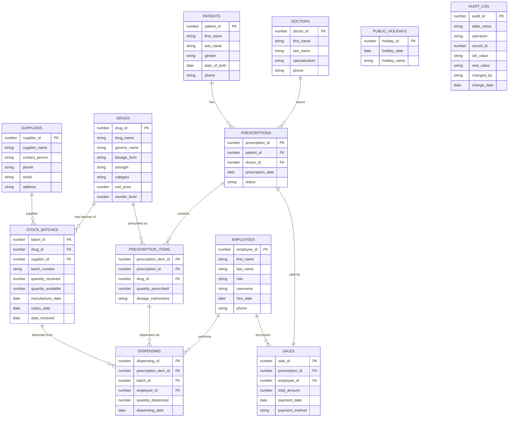

# Phase III — Entity Relationship Diagram

`30866_Shedrick_Pharmacy_DB` — Pharmacy Inventory & Prescription Tracking System

This diagram matches the corrected schema in `05_tables/05_tables_corrected.sql`
exactly (12 entities, including SALES and the batch-level DISPENSING link).
GitHub renders the Mermaid block below automatically when you view this file
in the repo — no image export needed.

## Notes on relationships

- **SUPPLIERS 1:M STOCK_BATCHES** — a supplier delivers many batches; a
  batch comes from exactly one supplier.
- **DRUGS 1:M STOCK_BATCHES** — a drug can have many batches on shelf
  at once (different expiry dates), which is exactly why expiry and
  reorder tracking has to live at the batch level, not the drug level.
- **PRESCRIPTIONS 1:M PRESCRIPTION_ITEMS** — resolves the many-to-many
  between prescriptions and drugs (one prescription can list several
  drugs).
- **PRESCRIPTION_ITEMS 1:M DISPENSING** and **STOCK_BATCHES 1:M DISPENSING**
  — together these are what make dispensing traceable down to *which
  batch* a given item was filled from, which is the core value
  proposition from the Problem Statement.
- **PRESCRIPTIONS 1:1 SALES** — each prescription is paid for exactly
  once; enforced in the DDL with `UNIQUE` on `sales.prescription_id`.
- **AUDIT_LOG** has no FK to any other table on purpose — it has to
  keep logging even if the record it refers to gets deleted, so it's
  intentionally decoupled (this is standard practice for audit tables,
  worth a one-line mention in your write-up so it doesn't look like an
  oversight).
